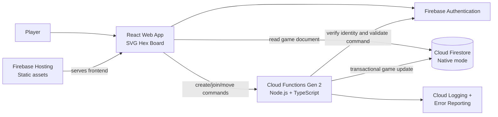
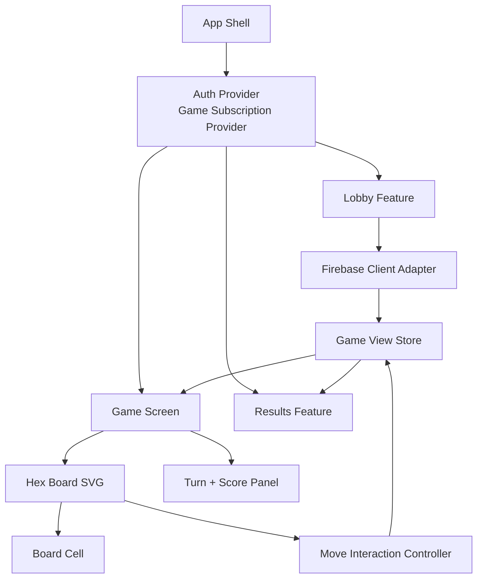
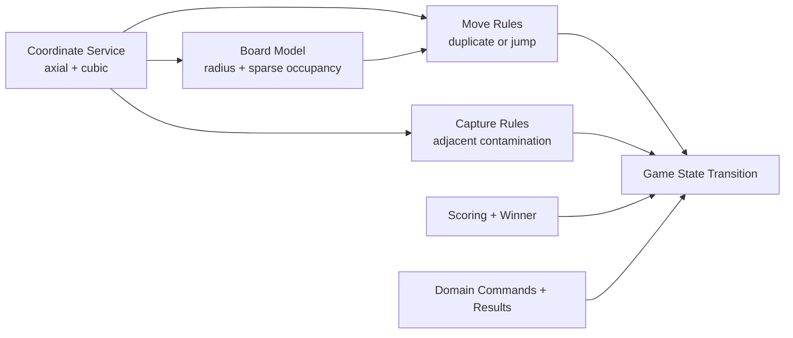
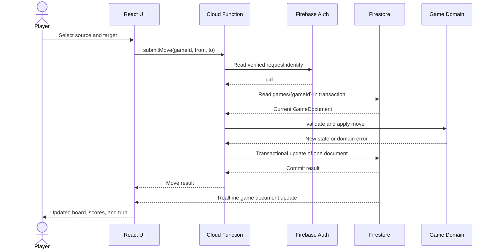
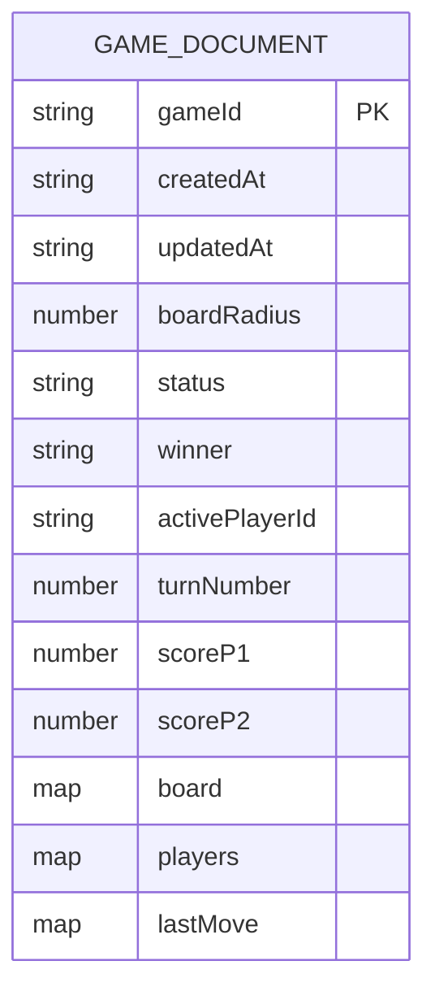
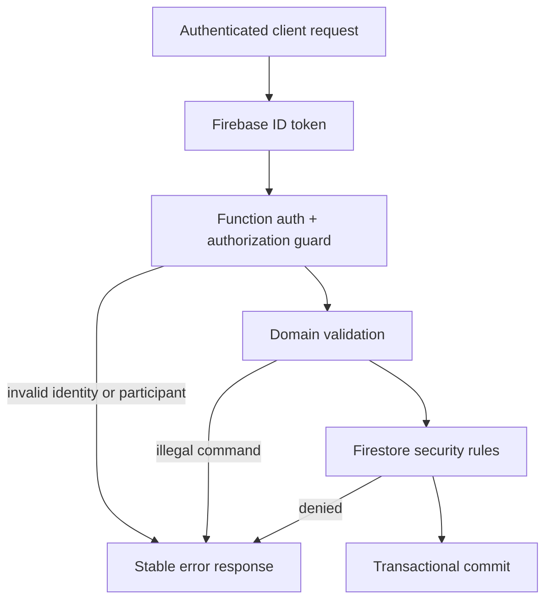
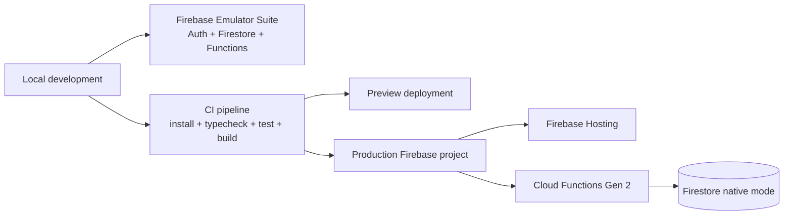

# Hexxagon Architecture

## 1. Purpose and Scope

Hexxagon is a turn-based strategy game inspired by Ataxx and Hexxagon. The overhaul separates the browser experience from authoritative game services while keeping the system small enough to remain eligible for the permanent Google Cloud Always Free quota.

This document describes the target architecture for the complete application. The `frontend/` directory currently contains the React/Vite foundation; the backend, shared domain package, and infrastructure are the next architectural slices to implement.

## 2. Architectural Principles

- **Server-authoritative rules:** the client may predict and render moves, but only the backend validates and commits them.
- **One game, one Firestore document:** every active game is stored at `games/{gameId}`. There are no per-cell or per-move subdocuments.
- **Pure game logic:** coordinate math, move generation, captures, scoring, and terminal-state evaluation are deterministic functions with no Firebase or HTTP dependencies.
- **Thin transport layers:** HTTP callable functions translate requests into domain commands and return domain results.
- **Sparse board state:** only occupied cells are stored in `board`; empty cells are derived from the board radius.
- **Explicit boundaries:** UI, application orchestration, domain rules, persistence, and infrastructure remain independently testable.
- **Quota-aware reads and writes:** game screens subscribe to one game document and commands update that document atomically.

## 3. System Context



### External components

| Component | Responsibility |
| --- | --- |
| Player | Uses the game UI, selects a source and target cell, and observes game state. |
| Firebase Hosting | Serves the built Vite application and static assets. |
| Firebase Authentication | Provides player identity and authenticated request context. Anonymous authentication can be used for an initial low-friction mode. |
| Cloud Functions Gen 2 | Exposes commands, validates moves, applies game rules, and writes game state. |
| Cloud Firestore | Stores one canonical `GameDocument` per game and provides realtime client updates. |
| Cloud Logging/Error Reporting | Captures function failures and operational diagnostics without introducing a separate observability service. |

## 4. Repository Target Structure

```text
hexxagon/
├── frontend/                     # React + TypeScript + Vite browser application
│   ├── src/
│   │   ├── app/                 # App shell, routing, providers
│   │   ├── components/          # Shared presentational UI
│   │   ├── features/
│   │   │   ├── lobby/           # Create, join, and game selection flows
│   │   │   ├── game/            # Board, turn state, move interaction
│   │   │   └── results/          # Scores, winner, rematch actions
│   │   ├── firebase/             # Client SDK initialization and subscriptions
│   │   ├── state/                # Session and game view state
│   │   └── styles/               # Global and feature styles
│   └── public/                  # Manifest and static assets
├── packages/
│   └── game-domain/             # Shared pure TypeScript rules and contracts
│       ├── coordinates/         # Axial/cubic conversion and distance
│       ├── board/               # Board generation and occupancy operations
│       ├── moves/               # Legal move generation and validation
│       ├── captures/            # Adjacent opponent contamination
│       ├── scoring/              # Scores and winner calculation
│       └── types/                # Commands, events, and GameDocument types
├── functions/                   # Cloud Functions Gen 2 backend
│   └── src/
│       ├── http/                # Callable/HTTP handlers and request validation
│       ├── application/         # Use cases and transaction orchestration
│       ├── repositories/        # Firestore gateway and document mapping
│       └── auth/                # Identity and authorization checks
├── firestore/                   # Rules, indexes, and emulator configuration
│   ├── firestore.rules
│   └── firestore.indexes.json
├── infra/                       # Firebase/GCP deployment configuration
├── docs/                        # Architecture and operational documentation
└── .github/                     # Repository instructions and CI workflows
```

The first implementation can keep `packages/`, `functions/`, and `firestore/` empty until those slices are introduced. The boundaries above are intentional and should not be collapsed into UI components or Firebase callbacks.

## 5. Frontend Architecture



### Frontend components

| Component | Responsibility | Boundary |
| --- | --- | --- |
| App shell | Initializes the application, providers, error boundary, and top-level route/view. | Does not implement game rules. |
| Auth provider | Exposes the current Firebase user and sign-in state. | Hides Firebase Auth SDK details from features. |
| Lobby feature | Creates a game, joins a game, and transitions into a game session. | Sends commands through the client adapter. |
| Game screen | Composes the board, turn information, scores, and connection state. | Renders state; does not mutate Firestore directly. |
| Hex board SVG | Renders the finite hexagonal board using pointy-topped geometry. | Receives cells and interaction state as props. |
| Board cell | Displays empty, owned, selected, legal-target, and recently-captured states. | Contains no move legality algorithm. |
| Move interaction controller | Tracks source/target selection and submits a move command. | May use domain helpers for local hints, but server response is authoritative. |
| Turn and score panel | Displays active player, player colors, scores, turn number, and status. | Purely presentational. |
| Results feature | Displays finished-game outcome and supports rematch/navigation actions. | Consumes canonical game status. |
| Game view store | Keeps the current game document, pending command, errors, and connection state. | Coordinates subscription updates and optimistic/pending UI. |
| Firebase client adapter | Wraps Auth, Firestore subscription, and callable function APIs. | The only frontend layer allowed to import Firebase SDK modules. |

### Frontend state flow

1. The user authenticates or receives an anonymous session.
2. The lobby sends `createGame` or `joinGame` through the Firebase client adapter.
3. The game view subscribes to exactly one `games/{gameId}` document.
4. The board derives all empty cells from `meta.boardRadius` and the sparse `board` map.
5. Selecting a legal-looking move creates a `submitMove` command.
6. The backend response and Firestore update replace any pending client state.
7. The results view appears when `meta.status` becomes `FINISHED`.

## 6. Domain Architecture

The domain package is framework-independent and should run in browser tests, backend tests, and property-based tests without Firebase, React, or Node-specific APIs.



### Coordinate system

- Storage coordinates are axial `(q, r)`.
- Calculations use cubic `(q, r, s)` with `s = -q - r`.
- Firestore board keys use the canonical string form `${q},${r}`.
- Distance is:

  `distance(A, B) = (abs(A.q - B.q) + abs(A.r - B.r) + abs(A.s - B.s)) / 2`

- Immediate neighbors are `(1, 0)`, `(1, -1)`, `(0, -1)`, `(-1, 0)`, `(-1, 1)`, and `(0, 1)`.
- Pointy-topped SVG projection is:

  `x = R * sqrt(3) * (q + r / 2)`

  `y = R * (3 / 2) * r`

### Rule components

| Domain component | Behavior |
| --- | --- |
| Board generator | Produces all valid axial cells inside radius `R`; does not persist empty cells. |
| Distance calculator | Computes cubic distance and rejects malformed coordinates. |
| Move generator | Produces empty targets at distance 1 or 2 from a player-owned source. |
| Move validator | Rejects occupied targets, invalid source ownership, distances over 2, inactive players, and finished games. |
| Duplicate transition | Distance 1: keeps the source and adds a new piece at the target. |
| Jump transition | Distance 2: removes the source and adds the piece at the target. |
| Capture resolver | Converts all adjacent opponent pieces around the destination to the active player. |
| Score calculator | Counts pieces by player from the sparse board map. |
| Terminal-state evaluator | Ends the game when the board is full, a player has no pieces, or no legal move remains. |
| Winner resolver | Selects the player with the highest score; ties follow an explicit product rule. |

## 7. Backend and Request Flow



### Backend components

| Component | Responsibility |
| --- | --- |
| Function entry points | Expose `createGame`, `joinGame`, `getGame` if needed, `submitMove`, `leaveGame`, and `rematch` commands. |
| Request validator | Validates payload shape, coordinate bounds, game ID format, and required fields before domain execution. |
| Authentication guard | Requires a verified Firebase identity and maps it to a game participant. |
| Authorization guard | Ensures only a participant can read or mutate a game and only the active player can move. |
| Application use cases | Orchestrate identity checks, repository reads, domain transitions, and result mapping. |
| Firestore repository | Maps Firestore documents to domain state and writes only the canonical game document. |
| Transaction boundary | Prevents concurrent moves from overwriting each other; revalidates against the latest document. |
| Error mapper | Converts domain errors into stable client-safe error codes and messages. |
| Logging adapter | Records correlation ID, function name, game ID, command, duration, and error category without secrets. |

## 8. Firestore Data Model

The canonical path is `games/{gameId}`. A game must not create subcollections for cells, moves, chat, or events under this cost-constrained design.



```typescript
interface GameDocument {
  meta: {
    createdAt: string;
    updatedAt: string;
    boardRadius: number;
    status: 'IN_PROGRESS' | 'FINISHED';
    winner: string | null;
  };
  players: {
    p1: { uid: string; displayName: string; color: string; isBot: boolean };
    p2: { uid: string; displayName: string; color: string; isBot: boolean };
  };
  turn: {
    activePlayerId: string;
    turnNumber: number;
    deadline?: string;
  };
  score: {
    p1: number;
    p2: number;
  };
  board: Record<string, string>; // "q,r" -> playerId
  lastMove?: {
    playerId: string;
    type: 'DUPLICATE' | 'JUMP';
    from: { q: number; r: number };
    to: { q: number; r: number };
    captured: string[];
  };
}
```

### Persistence rules

- Use server timestamps for `createdAt` and `updatedAt`.
- Treat `board` as sparse: absent key means empty valid cell; invalid/out-of-radius keys are rejected.
- Store the resulting score and `lastMove` in the same transaction as the board mutation.
- Use a transaction for every state-changing command.
- Use a single realtime document listener per active game in the browser.
- Keep document size bounded by the configured board radius.

## 9. Security Model



- The client never chooses the winner, score, active player, or final board state.
- Callable functions verify the Firebase token and participant membership.
- Firestore rules deny arbitrary client writes to game documents unless the chosen deployment model explicitly requires a tightly constrained client write. The preferred model is function-only mutation.
- Display names and colors are treated as untrusted input and normalized at the boundary.
- Function logs must not contain ID tokens or sensitive authentication data.
- Emulator tests must cover unauthenticated reads/writes, non-player access, inactive-player moves, malformed coordinates, and replayed/concurrent commands.

## 10. Deployment and Environments



### Environment components

- **Local:** Vite dev server, Firebase Emulator Suite, seeded test games, and browser integration tests.
- **CI:** dependency installation from lockfiles, domain unit tests, function tests, frontend typecheck, frontend build, and Firestore rules tests.
- **Preview:** isolated Firebase project or namespace for manual verification before production.
- **Production:** Firebase Hosting, Cloud Functions Gen 2, Firebase Authentication, Firestore native mode, and Cloud Logging.
- **Configuration:** public Firebase client configuration may be exposed to the browser; credentials, service account keys, and emulator/admin secrets must remain in environment or deployment secret storage.

## 11. Testing Strategy

| Layer | Test focus |
| --- | --- |
| Domain unit tests | Coordinates, distances, legal moves, duplicate/jump semantics, capture, score, and end conditions. |
| Domain property tests | Board invariants, coordinate round trips, no illegal occupied/out-of-radius cells, and deterministic transitions. |
| Repository tests | Serialization, deserialization, sparse board behavior, timestamps, and transaction mapping using emulators. |
| Function tests | Authentication, authorization, request validation, error codes, concurrency, and command orchestration. |
| Firestore rules tests | Read/write permissions for owners, participants, anonymous users, and unauthenticated clients. |
| Frontend component tests | Board rendering, selection states, legal target highlighting, pending/error states, and results. |
| Browser integration tests | Sign-in, create/join, realtime updates, move submission, reconnect, and finished-game flow. |

## 12. Operational Concerns

- Track function invocation count, latency, error rate, and Firestore read/write counts.
- Add a correlation ID to every command and include it in client-safe error responses.
- Keep the game document schema versionable; add a `schemaVersion` field before making incompatible changes.
- Prefer backwards-compatible migrations because existing games may remain active during deployment.
- Use exponential retry only for transient client reads; never blindly retry a rejected move command.
- Handle an offline browser as a stale view: it may show cached state, but a move must be revalidated against the server.

## 13. Initial Delivery Order

1. Extract the pure coordinate, board, move, capture, scoring, and terminal-state package.
2. Add domain tests and immutable state transitions.
3. Implement Firestore document mapping and emulator-backed repository tests.
4. Add authenticated `createGame`, `joinGame`, and `submitMove` functions.
5. Replace the frontend starter screen with the lobby and SVG board features.
6. Add realtime game subscription, pending states, errors, and results.
7. Add Firestore rules, CI checks, preview deployment, and production deployment configuration.
