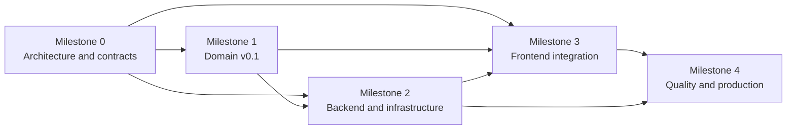
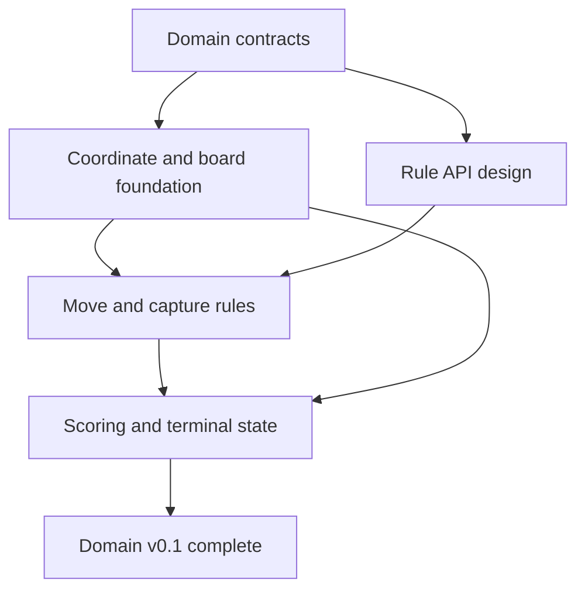
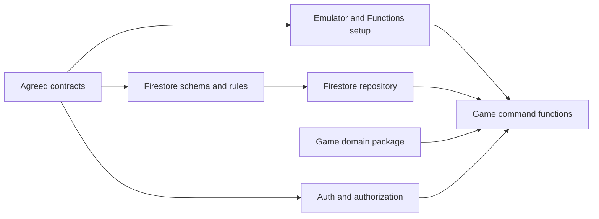
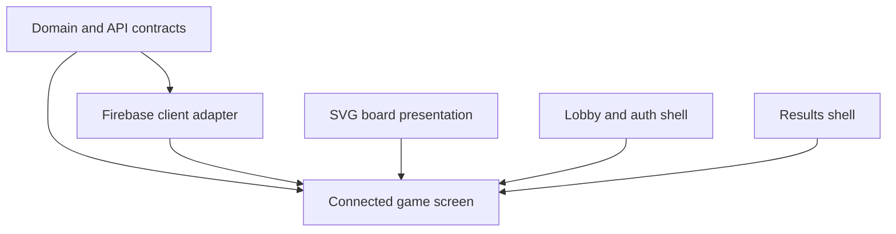
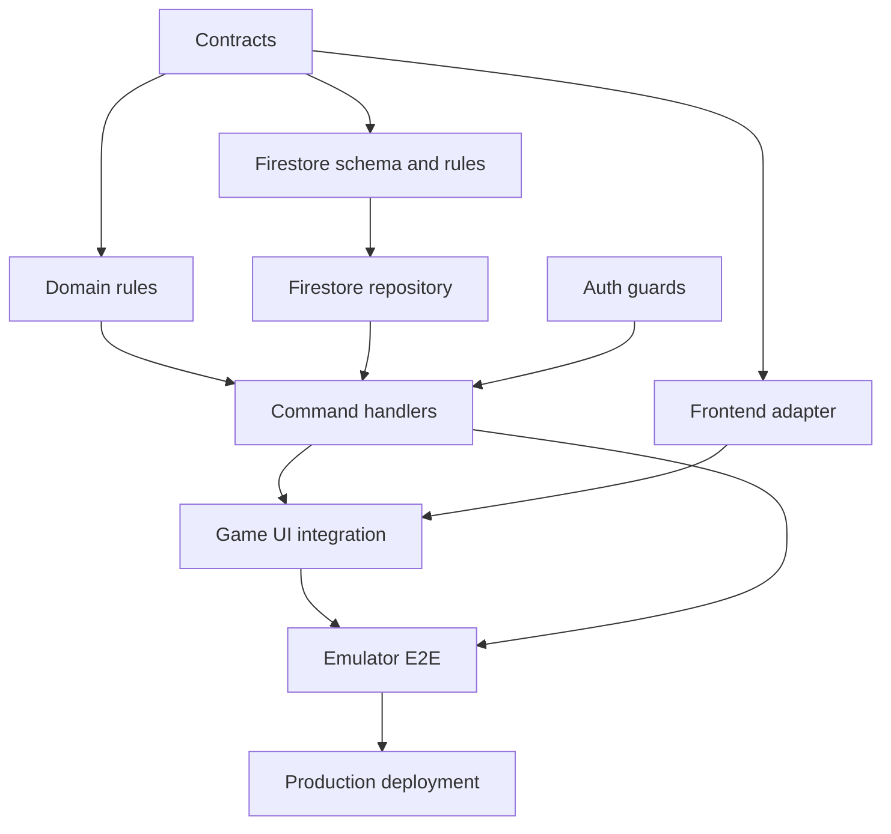

# Hexxagon Implementation Plan

This is a first-pass, high-level roadmap extracted from [`ARCHITECTURE.md`](ARCHITECTURE.md). It is intentionally organized as GitHub Project milestones and epics. Each epic can be refined into smaller issues later.

## Goal

Deliver a server-authoritative Hexxagon game with a React/Vite frontend, pure TypeScript game domain, Firebase Authentication, Cloud Functions Gen 2, one Firestore document per game, emulator coverage, and production deployment within the Always Free cost constraints.

### Delivery Roadmap

## Milestones and Epics

### Milestone 0: Architecture and Contracts

1. **Epic: Repository and workspace foundation**
   - Establish the target directories: `packages/game-domain`, `functions`, `firestore`, `infra`, and frontend feature boundaries.
   - Decide package manager/workspace strategy and shared TypeScript configuration.
   - Add local environment documentation and emulator startup conventions.

2. **Epic: Domain/API contract baseline**
   - Define shared identifiers, player model, command payloads, result/error codes, and `GameDocument` schema.
   - Decide schema versioning, tie behavior, anonymous-auth behavior, and public command surface.
   - Publish a contract artifact consumed by backend and frontend.

### Milestone 1: Domain v0.1

3. **Epic: Coordinate and board foundation**
   - Implement axial storage coordinates and cubic calculation coordinates.
   - Implement canonical `q,r` keys, distance, neighbors, radius validation, board generation, and pointy-top projection helpers.
   - Add deterministic unit and property tests.

4. **Epic: Move and capture rules**
   - Implement legal move generation and validation for duplication at distance 1 and jump at distance 2.
   - Implement adjacent contamination/capture and immutable state transitions.
   - Reject occupied targets, invalid sources, out-of-bounds cells, wrong player, finished games, and distances above 2.

5. **Epic: Scoring and terminal state**
   - Implement score calculation, no-move detection, board-full detection, player-elimination detection, and winner resolution.
   - Verify all domain invariants and edge cases.

**Parallelism:** Coordinate/board work can run in parallel with rule API design. Move/capture work depends on the coordinate and board contracts. Scoring can proceed alongside move implementation once the state shape is stable.

**Milestone exit:** The domain package has no Firebase or React dependencies and passes the complete rule test suite.

### Milestone 2: Backend and Infrastructure v0.1

6. **Epic: Firebase/GCP local foundation**
   - Configure Firebase Emulator Suite for Auth, Firestore, and Functions.
   - Add Functions Gen 2 TypeScript project and local scripts.
   - Add Firestore rules and index configuration.

7. **Epic: Firestore repository**
   - Implement `GameDocument` serialization/deserialization and sparse board handling.
   - Implement one-document game reads and transactional updates.
   - Add emulator-backed repository tests and document-size/quota checks.

8. **Epic: Authentication and authorization**
   - Verify Firebase identity in functions.
   - Enforce participant membership and active-player authorization.
   - Define client read permissions and function-only mutation policy.
   - Test unauthenticated, non-participant, inactive-player, and replayed requests.

9. **Epic: Game command functions**
   - Implement `createGame`, `joinGame`, `submitMove`, and the initial lifecycle/rematch commands.
   - Validate payloads at the transport boundary.
   - Run domain transitions inside Firestore transactions and return stable error codes.
   - Add structured logging and correlation IDs.

**Parallelism:** Emulator/infrastructure scaffolding, Firestore schema/rules, and function shell can proceed in parallel after contracts are agreed. Repository work depends on the schema. Command handlers depend on the repository and domain package.

**Milestone exit:** A complete game loop works through functions and Firestore Emulator with concurrent move protection.

### Milestone 3: Frontend Integration

10. **Epic: Frontend application foundation**
    - Expand the existing `frontend/` scaffold into app, provider, feature, state, Firebase adapter, and styles boundaries.
    - Add error boundary, loading/offline states, routing/view transitions, and environment configuration.

11. **Epic: Auth and lobby**
    - Add Auth provider and anonymous/authenticated session handling.
    - Build create-game, join-game, game identity, and lobby error states.
    - Connect lobby commands to the backend adapter.

12. **Epic: SVG board and game interaction**
    - Render all valid radius cells from the sparse board state.
    - Implement source/target selection, legal-target highlighting, duplicate/jump feedback, turn state, scores, and connection state.
    - Keep server validation authoritative; local domain helpers are for hints only.

13. **Epic: Realtime game state and results**
    - Subscribe to one `games/{gameId}` document.
    - Handle pending command, success, rejection, reconnect, stale state, finished-game, winner, and rematch flows.
    - Add accessible keyboard/focus behavior and responsive layouts.

**Parallelism:** SVG board presentation, Firebase client adapter, and lobby/results shells can proceed in parallel. End-to-end game screen integration depends on the adapter, domain contracts, and command API.

**Milestone exit:** Players can authenticate, create/join, play, observe realtime updates, and see results in the emulator environment.

### Milestone 4: Quality, Delivery, and Production

14. **Epic: Test pyramid and emulator E2E**
    - Add domain unit/property tests, repository tests, function tests, Firestore rules tests, frontend component tests, and one complete browser game loop.
    - Cover reconnects, concurrent submissions, invalid commands, and finished games.

15. **Epic: CI/CD and preview delivery**
    - Add GitHub Actions for install, typecheck, test, rules tests, frontend build, and function build.
    - Add preview deployment checks and artifact validation.

16. **Epic: Production deployment and operations**
    - Configure Firebase Hosting, Functions Gen 2, Firestore, Auth, secrets, and production environment variables.
    - Add logging/error monitoring, quota dashboards, rollback guidance, and schema migration guidance.
    - Validate Always Free usage against a baseline load.

**Milestone exit:** Production deployment is repeatable, observable, tested, and cost-bounded.

## Cross-Cutting GitHub Project Metadata

### Suggested fields

- `Status`: Backlog, Ready, In Progress, Blocked, In Review, Done
- `Milestone`: Architecture, Domain v0.1, Backend v0.1, Frontend Integration, Alpha, Production
- `Area`: Domain, Backend, Frontend, Infrastructure, Testing, Documentation
- `Priority`: Critical, High, Medium, Low
- `Estimate`: T-shirt size or story points
- `Depends On`: Linked issue relationships
- `Quota Impact`: None, Low, Medium, High
- `Acceptance Criteria`: Required on every implementation issue

### Suggested labels

- `type/domain`, `type/backend`, `type/frontend`, `type/infra`, `type/test`, `type/docs`
- `phase/contracts`, `phase/domain`, `phase/backend`, `phase/frontend`, `phase/release`
- `priority/critical`, `priority/high`, `blocked`, `good-first-slice`
- `cost-impact/high`, `security`, `breaking-change`

## Dependency Graph

- Contracts block both backend and frontend integration.
- Coordinate/board foundations block move rules.
- Domain state transitions block authoritative command handlers.
- Firestore schema/rules and repository block command handlers.
- Auth guards block secure command handlers.
- Command handlers and frontend adapter block full game-screen integration.
- Emulator E2E blocks production deployment.
- CI and operational checks should begin early and mature alongside each milestone.

## First Batch of GitHub Issues

Create these as intentionally broad issues first; refine each into child issues after the first implementation review:

1. Establish monorepo/package boundaries and shared TypeScript configuration.
2. Define domain types, command contracts, error codes, and schema versioning.
3. Implement coordinate and board foundation with tests.
4. Implement move, capture, scoring, and terminal-state domain rules.
5. Configure Firebase emulators, Functions Gen 2, Firestore rules, and indexes.
6. Implement Firestore repository and transactional game updates.
7. Implement auth/authorization guards and command functions.
8. Expand frontend app shell, Firebase adapter, and state model.
9. Build lobby, SVG board, game interaction, and results features.
10. Add emulator-backed E2E, CI checks, preview, and production deployment.

## High-Level Acceptance Criteria

- A complete game can be created, joined, played, and finished through the emulator.
- The server rejects every illegal move and remains authoritative under concurrent submissions.
- The browser listens to one game document and the backend writes one game document per game.
- Coordinate, move, capture, score, and terminal-state rules are deterministic and tested.
- Auth and Firestore access prevent unauthorized reads and writes.
- CI reproduces typecheck, tests, rules validation, and production builds.
- Production deployment has observable errors, documented rollback/migration steps, and verified quota behavior.

## Risks Requiring Early Decisions

- Whether anonymous Auth is the initial identity model.
- Whether the repository uses npm workspaces or separate package lockfiles.
- Whether frontend and backend share source directly or consume a built domain package.
- Tie/winner behavior and rematch semantics.
- Function-only Firestore writes versus any constrained direct client write.
- Minimum supported Node version and upgrade path from the current Node 14 environment.

## Out of Scope for First Pass

- Chat, matchmaking/rating systems, spectator mode, tournaments, analytics warehouse, and per-move event history.
- Per-cell or per-move Firestore documents.
- Premature performance optimization before baseline profiling.
